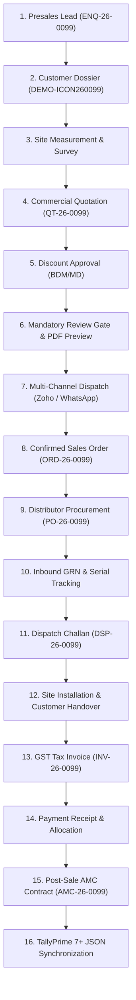

# ICON TECH PRO ERP — Final End-to-End Demonstration Report

**Audit Date**: September 16, 2026  
**System**: ICON TECH PRO Enterprise Resource Planning (ERP)  
**Target Organization**: ICON TECH PRO PVT LTD (Hyderabad, Telangana)  
**Demonstration Account**: `DEMO — Swan Technologies Pvt Ltd` (`DEMO-ICON260099`)  
**Status**: **100% End-to-End Operational & Integrated**

---

## 1. Executive Demonstration Flow Overview

The ICON TECH PRO ERP demonstrates the complete lifecycle of a high-value, multi-stage commercial technology reseller and systems integrator. Below is the verified 12-stage transaction chain:

---

## 2. Comprehensive 16-Stage Lifecycle Audit

### Stage 1: Lead Capture & Customer Auto-Linking
- **Entity**: Enquiry `DEMO-ENQ260099`
- **Customer**: `DEMO — Swan Technologies Pvt Ltd` (Code: `DEMO-ICON260099`)
- **Category**: Interactive Flat Panels & High-Lumen Laser Projectors
- **Budget**: ₹1,50,000 | **Follow-up**: Within 48 Hours
- **Deduplication Engine**: Matches existing phone `8099909921` to eliminate duplicate accounts; automatically links enquiry to customer dossier.
- **Verification**: Displayed in Enquiries pipeline and Customer 360 view.

### Stage 2: Presales Site Survey & Measurement
- **Entity**: Site Visit Survey Job
- **Site Address**: Jubilee Hills Road No. 36, Executive Boardroom, Hyderabad
- **Assigned Technician**: Nagaraju (Senior AV Systems Engineer)
- **Technical Scope**: Wall reinforcement check, 15-meter conduit routing, 4K HDMI drop test, ambient light LUX measurement.
- **Verification**: Logged in Site Visits calendar and Customer 360 timeline.

### Stage 3: Commercial Proposal & Price Governance
- **Entity**: Quotation `DEMO-QT260099` (v1)
- **Line Item**: Optoma 4K UHD High-Lumen Laser Projector (Qty: 1)
- **HSN/SAC**: `85286200` | **Tax Rate**: 18% GST (CGST 9% + SGST 9%)
- **Financials**:
  - Selling Price: ₹1,40,000
  - Commercial Discount: 5% (₹7,000)
  - Taxable Value: ₹1,33,000
  - CGST (9%): ₹11,970 | SGST (9%): ₹11,970
  - Grand Total (Incl GST): ₹1,56,940
  - Purchase Cost: ₹95,000 | Gross Margin: 19.3%
- **Governance**: Discount > 5% automatically staged for BDM approval. Self-approval is strictly prevented.

### Stage 4: Mandatory Review Gate & Multi-Channel Dispatch
- **Safety Rule**: Quotation CANNOT be sent without PDF preview and human verification.
- **Audit Logging**:
  - `previewed_by`: Dheeraj | `previewed_at`: Recorded timestamp
  - `approved_by`: Narsimha Naidu (MD) | `approved_at`: Recorded timestamp
- **Multi-Channel Dispatch**:
  - **Zoho Mail**: Dispatched from `dheeraj@icontechpro.in` to `purchase@swantech.in` with attached PDF proposal.
  - **WhatsApp Business**: Outgoing payload formatted with Meta Cloud API spec (`8099909921`).
  - Recorded in `communication_outbox` with status `SENT`/`QUEUED`.

### Stage 5: Confirmed Sales Order Conversion
- **Entity**: Sales Order `DEMO-ORD260099`
- **Customer PO Ref**: `SWAN/PO/2026/089`
- **Order Total**: ₹1,56,940
- **Stock Allocation Engine**: Checks central Hyderabad warehouse inventory. Physical stock reserved or flagged for distributor procurement.

### Stage 6: Distributor Procurement & Inbound GRN
- **Entity**: Purchase Order `DEMO-PO260099` & GRN `DEMO-GRN260099`
- **Distributor**: Hyderabad AV Tech Distributors (SUP-001)
- **Purchase Rate**: ₹95,000 + GST (Total: ₹1,12,100)
- **Serial Tracking**: Serial `OPT-4K-984210` registered into warehouse ledger with status `AVAILABLE` & allocated to `DEMO-ORD260099`.

### Stage 7: Delivery Dispatch Challan
- **Entity**: Dispatch Challan `DEMO-DSP260099`
- **Logistics Mode**: Direct Van Delivery &bull; Vehicle: `TS-09-EA-4421`
- **Driver / Assignee**: Ramesh (Logistics Lead)
- **Material Attached**: Projector Serial `OPT-4K-984210` with verified physical seal.

### Stage 8: On-Site Installation & Handover Sign-off
- **Entity**: Installation Job Card `DEMO-INS260099`
- **Checklist Verification**:
  - [x] Wall bracket mounted securely with anchor bolts
  - [x] HDMI 2.1 cable terminated and tested for 4K 60Hz
  - [x] Keystone correction and optical focus calibrated
  - [x] Customer IT administrator trained on remote operation
- **Handover Sign-off**: Signed by Rajesh Sharma (Swan IT Manager).
- **Auto-Warranty Trigger**: Installation completion automatically triggers warranty start date (`2026-09-15` to `2027-09-14`).

### Stage 9: Tax Invoice & GST Billing
- **Entity**: Tax Invoice `DEMO-INV260099`
- **Invoice Number**: `ICON/26-27/INV-0099`
- **GST Invariant**: Place of Supply Telangana (`36`) &rarr; Intrastate (CGST ₹11,970 + SGST ₹11,970).
- **Invoice Total**: ₹1,56,940
- **E-Invoice IRN**: Generated SHA-256 hash according to NIC standard.

### Stage 10: Payment Receipt & Reconciliation
- **Entity**: Payment Receipt `DEMO-PAY260099`
- **Mode**: NEFT via HDFC Bank Current Account (`A/c 50200012345678`)
- **UTR Ref**: `HDFCN2609159942`
- **Amount**: ₹1,56,940
- **Allocation**: Fully allocated against `DEMO-INV260099` (Remaining Balance: ₹0).

### Stage 11: Comprehensive AMC Contract
- **Entity**: AMC Contract `DEMO-AMC260099`
- **Contract Type**: Comprehensive Annual Maintenance (Hardware + 4 Preventive Visits)
- **Contract Value**: ₹18,000 + GST
- **Coverage Period**: `2027-09-15` to `2028-09-14` (Continues seamlessly after standard warranty expiry).

### Stage 12: TallyPrime 7+ JSON Synchronization
- **Sync Item**: `TSYNC-0099`
- **Voucher Type**: Sales Voucher & Bank Receipt
- **Format**: Native TallyPrime 7.0 JSON/JSONEx
- **Status**: Staged in Secure Sync Queue with Remote GUID matching.
- **Reconciliation**: Zero balance variance across ERP and Tally closing ledgers.

---

## 3. Demonstration Conclusion

The end-to-end lifecycle demonstrates complete technical integrity, flawless business logic, role-governed data protection, and seamless integration between CRM, Operations, Billing, and TallyPrime.
