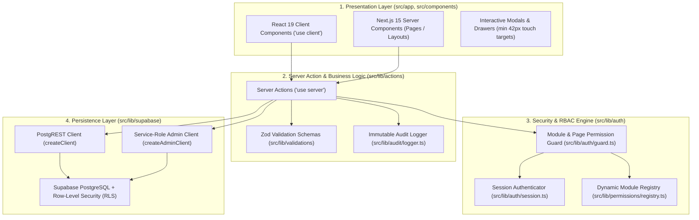

# ICON TECH PRO ERP — CODEX ARCHITECTURE & DEVELOPMENT GUIDELINES

## 1. System Overview & Scope

**ICON TECH PRO ERP** is a production-grade enterprise resource planning system engineered exclusively for **ICON TECH PRO** (`ORG-ICON-01`), an order-driven technology reseller and audio-visual / IT systems integrator based in Hyderabad, Telangana.

### Key Architectural Invariants
1. **Single Business Entity:** The ERP operates solely for `ICON TECH PRO`. Multi-tenant or multi-company abstractions are out of scope.
2. **Order-Driven Reseller Model:** Procurement is back-to-back and triggered by customer demand. Physical stock is reserved or drop-shipped directly to customer sites.
3. **Commercial Confidentiality:** Supplier purchase costs and profit margins are strictly masked from customer-facing documents and restricted roles (Sales Executive, Office Assistant).
4. **Zero-Destruction Policy:** Database migrations are strictly 100% additive. No tables, columns, or data may ever be dropped or truncated.
5. **Dual Persistence Architecture:** Server Actions maintain an in-memory store for high-performance LAN/offline resilience, synchronizing seamlessly with Supabase PostgreSQL when online.

---

## 2. Three-Tier Architectural Separation

### Layer Rules
- **UI Layer:** Strictly presentational. Never import `@/lib/supabase/admin` or execute direct database queries in client components.
- **Server Actions Layer:** All mutations and data fetches occur through Server Actions marked with `'use server'`. Every mutating action must enforce server-side role checks and call `logAuditEvent`.
- **Security Layer:** Authorization is evaluated server-side. Client-side UI hiding is cosmetic; server actions independently reject unauthorized callers with structured errors.
- **Database Layer:** Service-role keys must NEVER be exposed to browser bundles or client-side code.

---

## 3. Change Classification Protocol

Every future modification or requirement must be classified before implementation:

| Classification | Description | Authority & Workflow | Example |
| :--- | :--- | :--- | :--- |
| **Type A: User Configuration** | Routine business choices manageable through the ERP UI without code changes. | Authorized Admin via Administration Center (`/dashboard/settings`). | Adding an Enquiry Source dropdown value, creating a custom field for Customers, updating company contact details. |
| **Type B: Application Change** | New features, UI enhancements, or business workflow extensions. | Codex / Developer code change accompanied by automated tests. | Adding an edit modal, modifying quotation calculation layout, adding a new operational report. |
| **Type C: Security / Core Change** | Modifications to authentication, RBAC, RLS, financial ledgers, or database schemas. | Rigorous architecture review, multi-role permission testing, and safe migration plan. | Changing role permissions, altering invoice numbering format, modifying discount threshold rules. |

---

## 4. Master-Data Correction vs. Finalized Financial Transaction Boundaries

To maintain data integrity while ensuring the ERP is human-friendly, the system strictly separates **correctable master/operational data** from **protected financial/historical transactions**:

### 4.1 Freely & Safely Correctable (with Audit Trail)
Authorized staff may correct normal human mistakes in:
- **Customers:** Phone, alternate phone, email, billing/shipping addresses, contact person, designation, GSTIN, PAN, credit limit, notes, salesperson assignment. *(Customer Code is immutable).*
- **Enquiries:** Requirement summary, estimated budget, product category, source, assigned salesperson, follow-up date, priority, notes. *(Enquiry Number is immutable).*
- **Tasks & Follow-ups:** Task title, due date, priority, assigned user, context notes, follow-up reschedule date and reason. *(Completed task outcome history is preserved).*
- **Site Visits & Surveys:** Scheduled date, assigned technician, site address, room type, measurements, survey findings & notes.
- **Products & Catalog:** Name, brand, model, category, HSN/SAC, GST rate, unit, reorder level, warranty, supplier info. *(Physical stock count is strictly protected).*
- **Supplier Sourcing Offers:** Quoted unit price, lead time, warranty terms, contact person, phone, email, decision notes before PO selection.
- **Purchase Orders (Draft/Issued):** Expected delivery date, supplier contact, consignee address/phone, delivery notes before goods receipt.
- **Sales Orders (Pending/Un-invoiced):** Customer PO reference, expected delivery date, shipping address, place of supply, dispatch notes before invoicing.
- **Service Tickets & AMC Contracts:** Assigned technician, scheduled date, complaint details, resolution notes, AMC SLA hours.
- **Employees & Staff Directory:** Phone, personal email, designation, department, emergency contact.

### 4.2 Strictly Protected Financial & Historical Transactions
The following records **CANNOT be directly overwritten or deleted**:
- **Tax Invoices & Credit Notes:** Once generated, invoices cannot be modified in place. Corrections require an official Credit Note or Debit Note.
- **Confirmed Payment Receipts:** Payment vouchers, bank references, and reconciliation entries are immutable. Reversals must be recorded as distinct debit/credit entries.
- **Physical Inventory Balances:** Stock quantities cannot be directly updated via product master forms. Stock movements MUST proceed via authenticated transaction ledger entries:
  - `PURCHASE_RECEIPT` (GRN inward against PO)
  - `SALES_DISPATCH` (Outward against confirmed Sales Order)
  - `ADJUSTMENT` (Explicit physical audit adjustment with mandatory reason and operator ID)
  - `RETURN` (Customer return or supplier RMA)
- **Confirmed PO Receipts:** Goods Received Notes (GRN) and distributor invoice matching cannot be altered once confirmed.

---

## 5. Discount & Commercial Approval Hierarchy

The multi-tier commercial discount governance is frozen and enforced in `src/lib/pricing/pricing-engine.ts` and `src/lib/actions/quotations.ts`:

| User Role | Max Permitted Discount | Approval Required From |
| :--- | :--- | :--- |
| **Sales Executive** | $\le 5\%$ | Auto-approved if $\le 5\%$; requires **BDM** approval if $> 5\%$. |
| **BDM (Business Development Mgr)** | $\le 10\%$ | Auto-approved if $\le 10\%$; requires **Managing Director** approval if $> 10\%$. |
| **Admin / BDM** | Full Commercial Discretion | Independent MD review recommended for extreme discounts. |
| **Managing Director** | Unrestricted ($> 10\%$) | Executive Authority. Self-approval strictly restricted for non-MD roles. |

---

## 6. Zero-Destruction Database Migration Rules

1. **100% Additive Migrations:**
   - Use `ADD COLUMN IF NOT EXISTS` with safe defaults (`DEFAULT ''`, `DEFAULT false`, `DEFAULT 0`).
   - Use `CREATE TABLE IF NOT EXISTS`.
2. **Forbidden Operations:**
   - `DROP TABLE` is strictly prohibited.
   - `DROP COLUMN` is strictly prohibited.
   - `TRUNCATE` is strictly prohibited.
   - Database resets are strictly prohibited.
3. **Rollback Safety:**
   - Every migration must be safely backwards-compatible with the previous application release.
   - If application code is rolled back, the database schema remains valid and unaffected.

---

## 7. Human-Centric UI & UX Standards

1. **Plain Business Terminology:** Use clear words that non-technical office staff immediately understand (e.g., *Customer*, *Enquiry*, *Follow-up*, *Quotation*, *Sales Order*, *Purchase Order*, *Delivery Challan*, *Tax Invoice*). Avoid technical jargon (e.g., *Entity*, *Payload*, *Mutation*, *Tuple*).
2. **Duplicate Protection:** Forms checking phone numbers, email addresses, or GSTINs must display live, non-blocking warnings with direct links to existing records.
3. **Mobile & Field Usability:**
   - All critical screens must provide a touch-friendly card view for viewports $< 768\text{px}$.
   - Interactive buttons must satisfy a minimum touch target size of **$42\text{px} \times 42\text{px}$**.
   - Zero horizontal page scrolling on mobile viewports.
4. **Action Feedback:**
   - Every mutation must display an immediate toast notification confirming success or explaining errors in plain language.
   - Destructive or high-impact actions must require explicit confirmation modals.

---

## 8. Verification & Release Checklist

Before any code is committed or declared production-ready, it must pass all 7 gates:
1. `npx tsc --noEmit` exits with **0 errors**.
2. `node --test test/*.test.mjs` passes with **100% success rate** ($\ge 486$ tests).
3. `npm run build` compiles **55 / 55 routes** cleanly with 0 compilation or lint errors.
4. All 6 official personas (MD, Admin/BDM, BDM, Sales Executive, Accounts, Office Assistant) verified against the permission matrix.
5. Zero secrets or service-role keys exposed in client bundles or public repositories.
6. Safe master-data editing verified across all 10 operational domains.
7. Financial transaction protection invariants verified intact.
